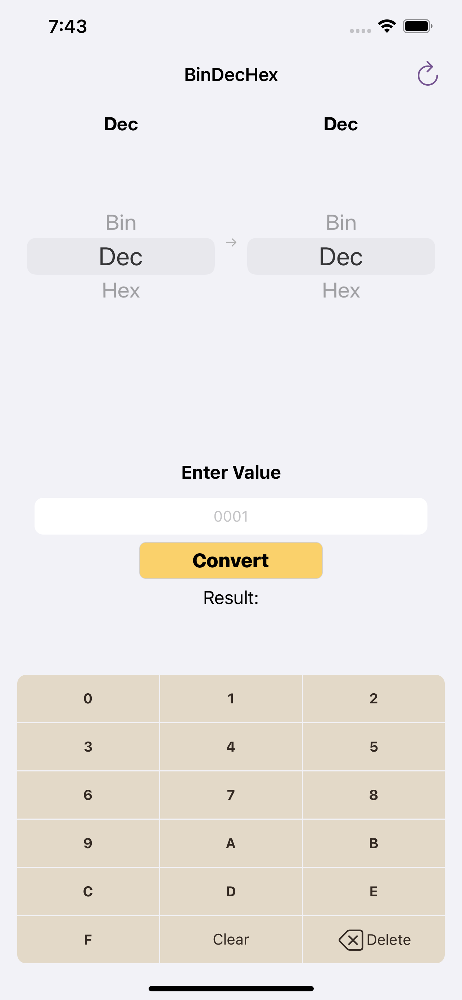

# BinDecHexApp, iOS Developer: Elias H.

**Run instructions:**
Xcode 11.3, iOS Deployment Target: 13.2, 

**Overview:**
This app is a binary/decimal/hexadecimal converter

**Walkthrough:**
User enters app, selects input unit(bin/dec/hex), selects output unit(bin/dec/hex), enters value amount, then taps convert. The user will then see their converted value under result. Result and settings are persisted in core data, for future app access. User can tap refresh to reset view to default settings.

**User permissions:**
No login required

**Tools used:**
Core Data, UIKit, iPhone 11 Pro/ iPhone 11 simulator, iPad Pro

**Select below for larger clearer images**

